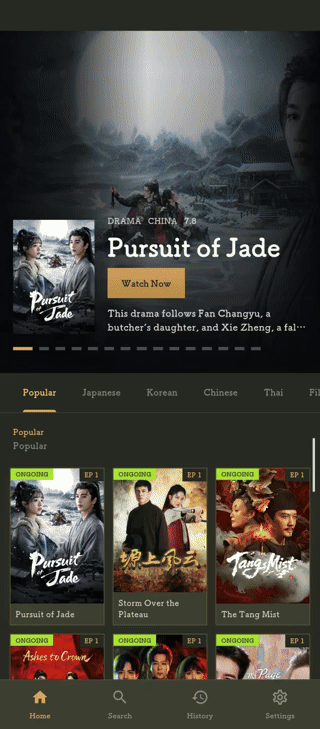
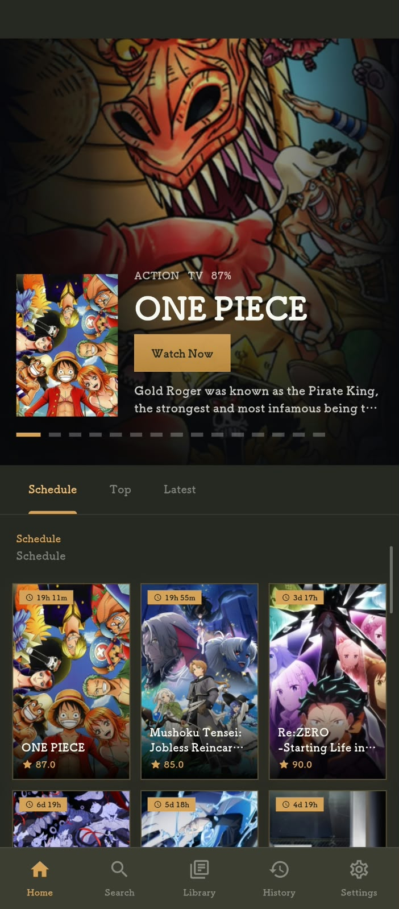

# LimeSugar

**LimeSugar** - Premium Anime, Drama & Hollywood Streaming App

Built with Flutter for Android & Windows.

---

## Download

### Latest Release: [v0.1.3-beta](https://github.com/keiz7en/LimeSugar/releases/tag/v0.1.3-beta)

| Platform | Download | Requirements |
|:---:|:---:|:---|
| **Android (universal)** |  | Android 5.0+ (API 21) |
| **Windows** |  | Windows 10/11 (x64) |

> **Note:** Per-ABI Android APKs (arm64-v8a, armeabi-v7a, x86_64) are also in the release assets. macOS, iOS, Linux and Web builds coming soon.

- **Source Code** — Private (contact for access)

---

### Preview

### Screenshots

| Player (Drama) | Library (Hollywood) |
|:---:|:---:|
|  |  |

---

## Features

### Content Library
- **Anime** — Thousands of titles with seasons, episodes, genres, scores, synopsis
- **Drama** — Asian dramas (Korean, Japanese, Chinese, Thai, Filipino, English) with full episode lists
- **Hollywood** — Movies & series with latest releases, popular titles, airing shows
- **Multi-mode** — Switch between Anime / Drama / Hollywood instantly in Settings

### Smart Discovery
- **Home tabs per mode:**
  - Anime: Airing Schedule · Top Rated · Latest Episodes
  - Drama: Popular · By Country · Airing Now
  - Hollywood: All · New Releases · Popular · Airing
- **Ongoing badge** — Auto-detected on cards (shows currently airing)
- **Year-based sorting** — Newest content first (2026 → 2025 → 2024)
- **Quick search suggestions** per content type

### Universal Search
- Real-time search across all modes
- Anime: Full AniList integration (genres, schedule, top, trending)
- Drama/Hollywood: Optimized search with instant results
- Search history & quick picks

### Video Player (MediaKit)
- **HLS / DASH / MP4** native playback
- **8 MB buffer** for smooth streaming
- **30 s timeout** with auto-retry (150 ms delay)
- **Multi-server fallback** — cycles through available CDNs automatically
- **Per-server Referer headers** for CDN compatibility
- **External player option** — Open in VLC/MX Player/any video app

### Playback Features
- **Resume from last position** — Dialog on reopen
- **Auto-save progress** every 5 seconds
- **Episode navigation** — Next/Previous with swipe
- **Quality selection** when available
- **Wake lock** — Screen stays on during playback
- **Auto-rotate** (configurable)

### Library & History
- **Anime Library** — Add/remove, status tracking (Watching, Completed, On Hold, Dropped, Plan to Watch)
- **Watch History** — Unified across all modes with timestamps
- **Per-episode progress** saved locally

### UI / UX
- **Nipah Dark Theme** — Custom dark palette with gold accent
- **3-second cinematic splash** (manim-generated video intro)
- **Smooth animations** — Tab transitions, hero carousel, fade/scale
- **Shimmer loading** placeholders
- **Dynamic bottom navigation** — Mode-aware tabs
- **Pull-to-refresh** on all lists

### Settings
- Content mode toggle (Anime / Drama / Hollywood)
- Theme & accent color
- Language (English, Spanish, Portuguese, Japanese, Chinese, Thai)
- Video quality preference (Auto / 1080p / 720p / 480p)
- Auto-rotate toggle
- NSFW filter
- Update checker (GitHub releases)

### Technical
- **Flutter 3.x** with Material 3
- **MediaKit** for cross-platform video
- **CachedNetworkImage** for fast posters/banners
- **SharedPreferences** for local persistence
- **Zero hardcoded API keys** — all endpoints configurable

---

## Changelog Highlights

| Version | Notes |
|---------|-------|
| 0.1.2 | Version label fix, AnimeKai (Server 2) + AnimeHeaven (Server 1), release-only public repo |
| 0.1.1 | Per-ABI Android APKs + Windows build |
| 0.1.0 | Initial public release (Anime / Drama / Hollywood) |

---

## License & Legal

### Proprietary License
**LimeSugar** is proprietary software. All rights reserved.

**Copyright © 2024-2025 LimeSugar. All rights reserved.**

This software and its associated documentation are protected by copyright law and international treaties. Unauthorized reproduction, distribution, modification, reverse engineering, or creation of derivative works is strictly prohibited.

### Disclaimer of Warranties
**THE SOFTWARE IS PROVIDED "AS IS" WITHOUT WARRANTY OF ANY KIND, EXPRESS OR IMPLIED, INCLUDING BUT NOT LIMITED TO THE WARRANTIES OF MERCHANTABILITY, FITNESS FOR A PARTICULAR PURPOSE, AND NONINFRINGEMENT.**

The authors and copyright holders make no representations or warranties about:
- The accuracy, completeness, or reliability of content accessed through this application
- The availability, continuity, or performance of streaming services
- The legality of content in your jurisdiction
- Freedom from viruses, malware, or other harmful components

### Limitation of Liability
**IN NO EVENT SHALL THE AUTHORS OR COPYRIGHT HOLDERS BE LIABLE FOR ANY CLAIM, DAMAGES, OR OTHER LIABILITY, WHETHER IN AN ACTION OF CONTRACT, TORT, OR OTHERWISE, ARISING FROM, OUT OF, OR IN CONNECTION WITH THE SOFTWARE OR THE USE OR OTHER DEALINGS IN THE SOFTWARE.**

This includes but is not limited to:
- Direct, indirect, incidental, or consequential damages
- Loss of data, profits, or business opportunities
- Legal fees or costs arising from use of the application
- Any issues related to third-party content, links, or services

### Third-Party Content
This application aggregates and provides access to publicly available streaming links. **We do not host, store, upload, or control any video content.** All videos are streamed from third-party sources. We are not responsible for:
- Content availability, quality, or legality
- Copyright status of third-party content
- Changes to external APIs or streaming endpoints
- Geographic restrictions or regional blocking

### User Responsibility
By using this application, you agree to:
- Comply with all applicable laws in your jurisdiction
- Respect intellectual property rights of content creators
- Use the application for personal, non-commercial purposes only
- Not attempt to circumvent any access controls or protection measures

### No Affiliation
**LimeSugar is not affiliated with, endorsed by, or connected to any streaming service, content provider, or platform** whose content may be accessible through this application. All trademarks, service marks, and trade names referenced are the property of their respective owners.

### Updates & Termination
We reserve the right to modify, suspend, or discontinue the application (or any part thereof) at any time without notice. We are not liable for any interruption or cessation of service.

### Governing Law
This license shall be governed by and construed in accordance with applicable laws. Any disputes arising from use of this software shall be subject to the exclusive jurisdiction of the competent courts.

---

**By downloading, installing, or using LimeSugar, you acknowledge that you have read, understood, and agree to these terms.**

---

**LimeSugar** — Stream smart. Watch anywhere.
